# aigccat

A general-purpose 3D game asset platform — describe what you want in natural language, get a Unity / Godot-ready 3D asset (GLB + Asset Contract).


Telegram community: https://t.me/aigccat · [中文](README.md) · [Deployment Guide](docs/DEPLOYMENT.md) · [Docs Index](docs/README.md) · [Sponsorship](docs/SPONSORSHIP.md)

---

## What it is

aigccat is a **self-hosted AI 3D asset pipeline**: generate models from text or images, with versioning, validation, post-processing, rigging/animation and engine delivery — all running on your own machine, with assets stored in your own MinIO.

It is not a "look, it makes a model" demo. It exists to solve the unglamorous problems of real game projects: every NPC ends up with the same face, a small tweak forces a full regeneration, materials turn magenta after export, a cleanup script deletes a published asset, API costs are invisible, and reviewers are asked to approve from a single image.

## Screenshots

### Multi-account pool & custom model services (v0.4)

**One page manages every model credential** — a sub2api-style account pool: each
provider can hold multiple accounts (subscription / API key / custom model service),
with live status dots, one-click "current" switching, enable/disable and delete.

**Custom model services**: any OpenAI-compatible endpoint plugs in — enter the base
URL and key, and the upstream model list is imported automatically on save. Text and
image models can live in the same account; image models appear in Image Studio directly.
**Model assignment**: pick one model per purpose — image (four-views), text LLM
(AI rigging), vision (multimodal), 3D — across providers, effective immediately.
A chat test box sits at the bottom of the page: pick any model and fire a quick
text/image request to prove the account works.

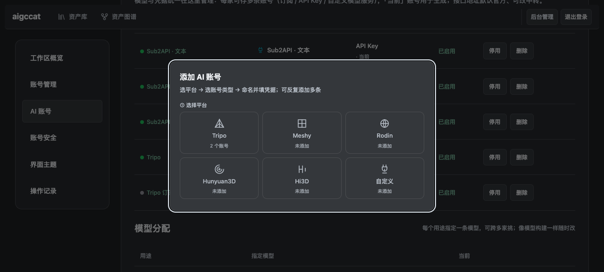

### Workbench

11 tools, a 3D viewport with orientation controls, and an asset panel on the right; the six-step workflow indicator sits on top.

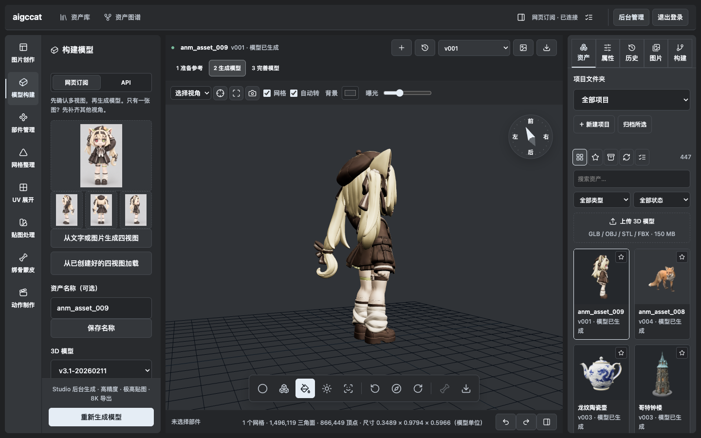

A first run starts from a single sentence — or upload reference images directly:

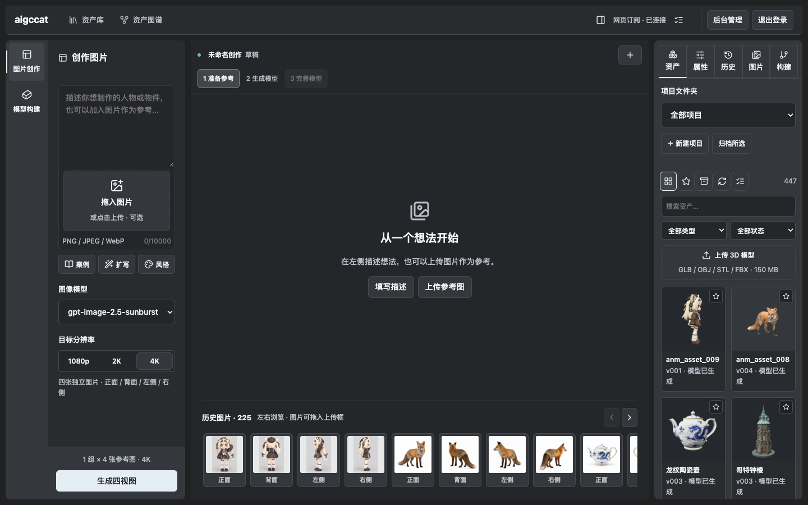

### Model building & recycle bin

No more separate "web subscription / API" UIs — pick a provider and go; whether Tripo
uses your subscription or an API key is decided by the current account, right on the card.
Every generation parameter has a ? help button (faces / geometry / quads / texture / PBR /
texture quality / export size), plus a beginner guide for newcomers. The recycle bin can
now **permanently delete assets — MinIO data included** (double confirmation, irreversible).

### Tools

| Image creation: text + optional image, producing four views at once | Texture: AI / existing / tiling / hand-painted |
|---|---|
| 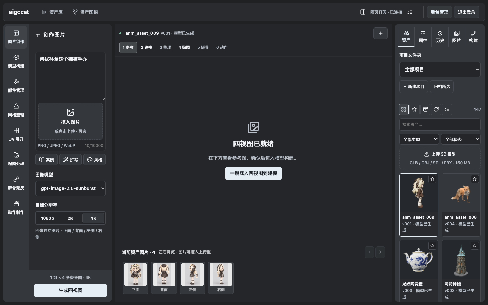 | 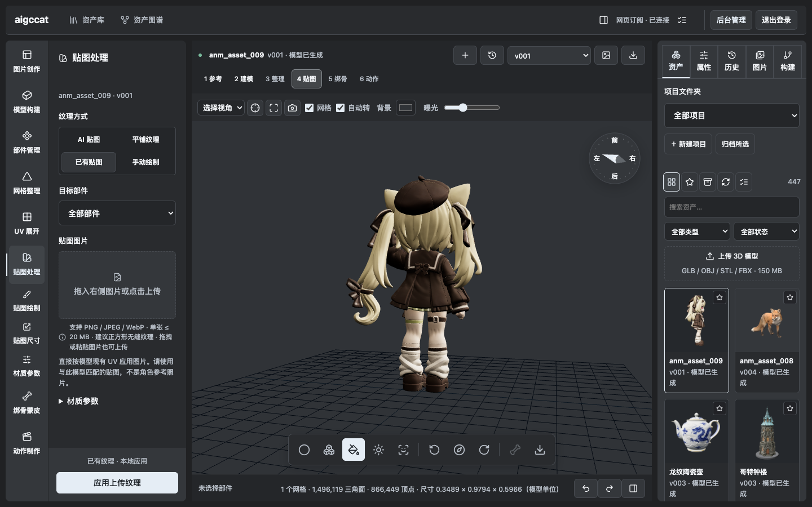 |

| Remesh: decimate / retopologise / quad | UV unwrap: smart / angular |
|---|---|
| 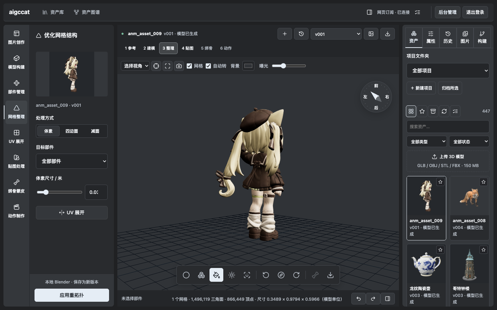 | 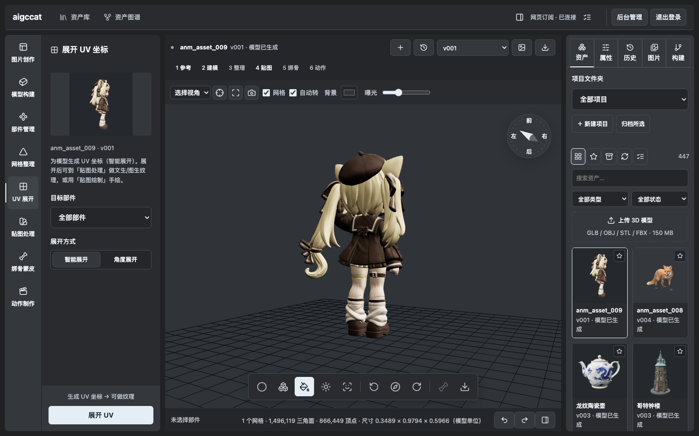 |

Animation: 101 motion templates, applicable straight to the model

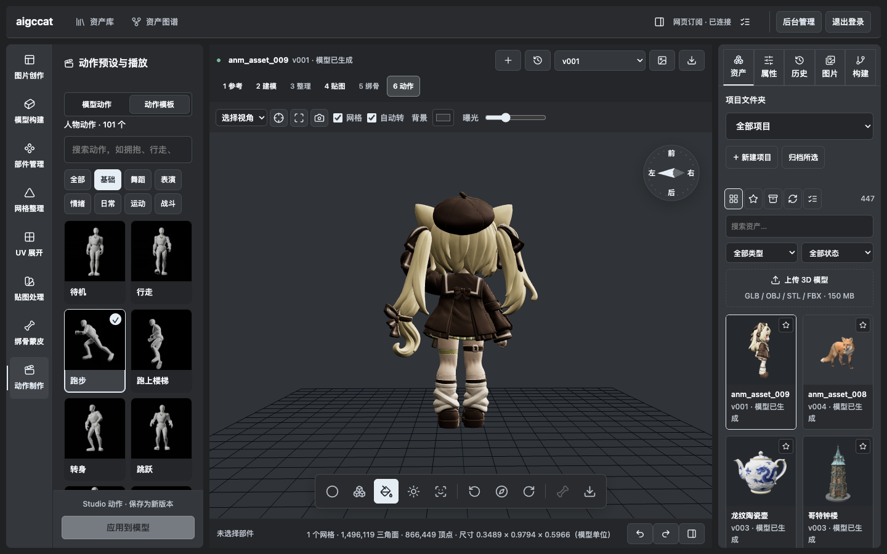

### Assets

| Asset library: categories, search, batch ops, recycle bin | Asset graph: five node levels, four layouts |
|---|---|
| 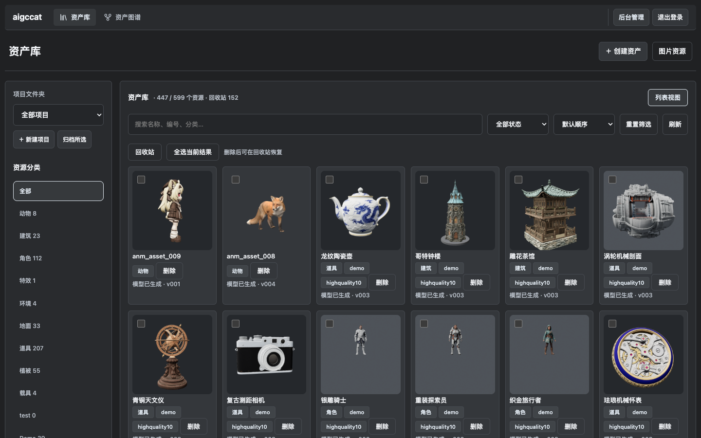 | 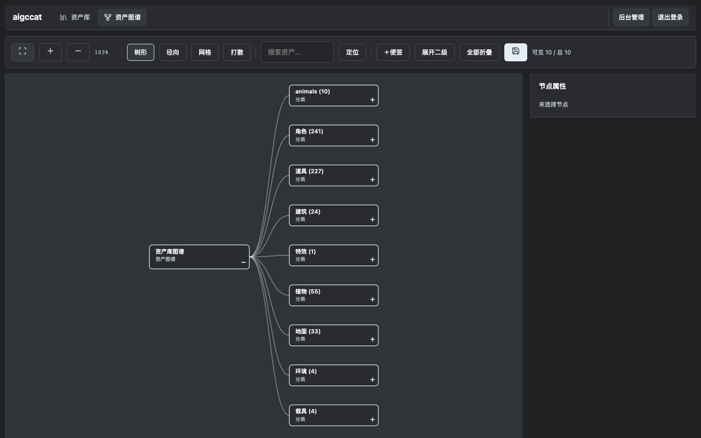 |

Image inventory: each asset's four views kept as a separate group, originals downloadable

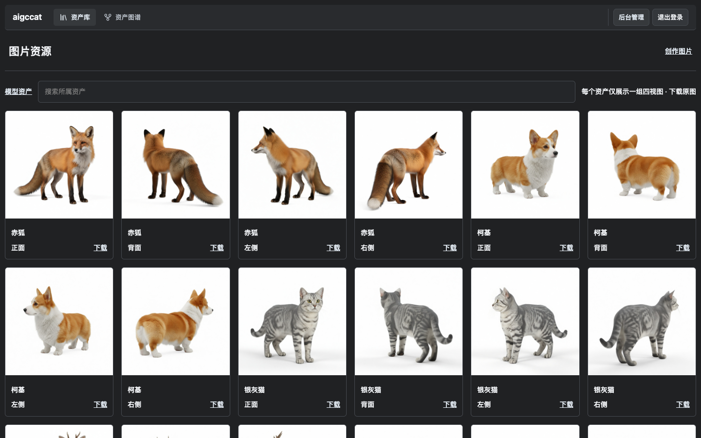

### Panels

| Properties: pipeline stages, asset info, references | History: version history and operation log |
|---|---|
| 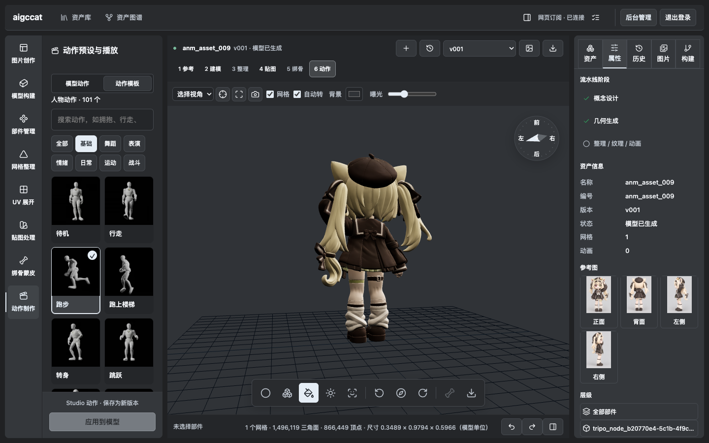 | 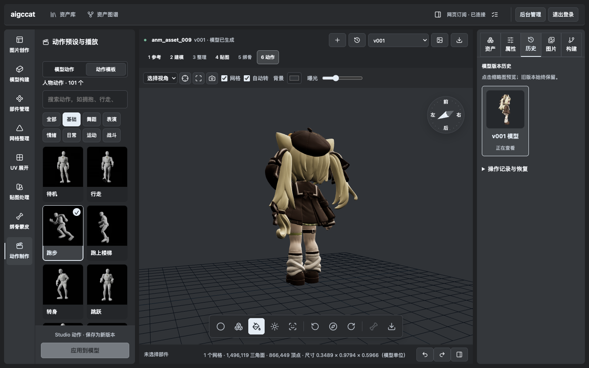 |

## Features

**Asset management**

- Auto-classification into 12 controlled categories; jobs are separate from assets
- Three version pointers: `latest` / `approved` / `published`, with a published lock and one-click rollback
- Append-only history tree — check out any past version; HEAD moves, nodes are never deleted
- Incremental spec editing with diffs; candidate batches and anchor selection

**Generation and post-processing**

- Model inputs: text / single image / multi-view / batch
- 10 post-processing operations: decimate, remesh, quad, split, UV, material, upscale, rig, animation, transform
- Rigging and animation: apply Studio motion templates, or local AI rigging (an AI writes Blender scripts, executed through an OpenCode container)

**Quality and traceability**

- GLB structural validation: bounding box, height ratio, topology stats
- QA multi-view render sets; side-by-side version comparison
- Cost ledger with budget circuit breaker
- Engine bundle packaging (GLB + Contract + outline + manifest)

**Interface**

- Workbench with 11 tools; infinite-canvas asset graph (5 node levels, 4 layouts)
- Multi-account pool: subscription / API key / custom model services in one place —
  switch current, enable/disable, fetch the upstream model list
- Model assignment: assign one model per purpose (image / text LLM / vision / 3D) across providers
- Parameter help: hover tooltips for 7 generation parameters + a beginner guide
- Asset library, image inventory, project archiving and a recycle bin (with permanent delete, MinIO data included)
- Unified login for local / LAN / public access; admin console with overview, accounts, AI accounts, security, theme and audit log

**Delivery**

- Unity and Godot import adapters
- MCP channel (17 tools)

## Architecture

```
browser ──► gateway :8080   (the only exposed port; unified auth)
               │
               ▼
           web :8080        (Rust / axum, single static binary, not published to the host)
               │
               ├── MinIO    (single source of truth for assets)
               │
               ├── :8788  Blender 5.2.1   (decimate / remesh / part edit / auto-rig)
               ├── :4097  OpenCode        (AI writes Blender scripts)
               └── :8791  OpenCode → Blender bridge
```
**All of the above live in a single container** — one `docker run`, no Blender install needed.

**The subscription-login browser lives in the container too**: it spins up a virtual
display + Chromium + VNC inside, embedded right in the web UI — the host needs no
browser installed at all.

- **Backend**: Rust + axum. All routes are registered in `web/src/main.rs`; modules only provide handlers
- **Frontend**: framework-free, build-free vanilla HTML/JS/CSS with a locally vendored Three.js
- **Storage**: MinIO (S3-compatible). Object keys are path-shaped and map 1:1 onto a local filesystem
- **Workers**: the amd64 image ships Blender 5.2 built in (arm64 falls back to a host
  install); the login Chromium and the AI-rigging OpenCode also run inside the container

## Community & feedback

**The Telegram group is the project's home base**: https://t.me/aigccat

- Wondering whether this actually works for your project → come ask
- Something feels off, or a feature you'd cut or add → **say it directly; we prioritize by feedback**
- Stuck on deployment or platform setup → drop the error message in, we answer when we see it

## On sponsorship

The project currently runs on one personal computer, with no server and no paid
credits on generation platforms, so some integrations remain untested (our rule:
if it hasn't run, we don't write "supported"). If you happen to have spare API
credits, keys or a small server to offer, details are in
**[Sponsorship & platform access](docs/SPONSORSHIP.md)** — and if not, that's
perfectly fine too: showing up in the group with feedback is the biggest help.

## Quick start

**Option A · One-line deploy (recommended)**

```bash
mkdir -p aigccat-deploy && cd aigccat-deploy
curl -sSL https://raw.githubusercontent.com/RainNameless/aigccat/main/deploy/docker-deploy.sh | bash
```

The script downloads the compose file, starts the container and prints the
initial admin credentials (secrets and 4 demo assets are seeded automatically
on first boot — no .env needed).

**Option B · Plain docker run**

```bash
docker run -d --name aigccat -p 8080:8080 -v aigccat-data:/data \
  ghcr.io/rainnameless/aigccat:latest
``

> **About Blender**: the amd64 image **bundles Blender 5.2** — decimate / remesh / part edit /
> auto-rig work out of the box. The arm64 image does not include Blender, because Blender only
> publishes a **Linux x64** build (macOS and Windows have arm64 builds, Linux does not).
> In that case the container automatically uses the **Blender on your host** — so on Apple
> Silicon, install Blender once and those features light up.


Open `http://localhost:8080`. The initial admin password is printed once on first start:

```bash
docker logs aigccat | grep -A2 "initial account"
```

One container holds storage (MinIO), the backend, the auth gateway and the AI rigging executor.
**No local compile, no .env needed** — secrets and the admin account are generated on first start and
kept in the data volume. All state lives in `aigccat-data`, so backup and migration are a single volume copy.

> Both Apple Silicon and x86 images are published. Pin a version by replacing `:latest` with `:sha-xxxxxxx`.

**Option B · multi-container (development, or multi-user / public deployment)**

```bash
git clone https://github.com/RainNameless/aigccat.git && cd aigccat
cp .env.example .env          # set MINIO_ROOT_PASSWORD and your service keys
docker compose -p aigccat -f docker-compose.yml up -d --build
```

For host workers, public deployment and troubleshooting, see the **[Deployment Guide](docs/DEPLOYMENT.md)**.

> Want the "web subscription" path to actually produce models (spending your own account's credits)?
> That path needs a one-time session connection on your own machine:
> **[Connecting your own web-subscription session](docs/STUDIO-SESSION.md)**.

## Not implemented / not verified (stated honestly)

- The Tripo **API** path exists but was **never verified end to end** — the account balance was 0. Everything actually produced came through the Studio web-subscription path
- Studio **free-prompt motion** and **arbitrary-body rigging** are not wired up (humanoid is tested; other body types are not guaranteed)
- **AI texturing** (Studio texture) failed upstream three times; the frontend entry is disabled
- Prompt-to-skeletal-animation and a real-device Unity adapter smoke test are unfinished

**Other generation platforms are not integrated at all**: Meshy, Rodin / Hyper3D, Hunyuan3D,
TRELLIS 2, Hi3D. The provider layer is built to be pluggable, but we have not been able to pay for a
single real call on any of them — and without real calls we don't write "supported".
We're looking for sponsors, see the section above.

## Known limitations

- Designed for **single-machine, single-user** self-hosting: concurrency is fixed at 1, accounts share one asset library, and there is **no tenant isolation**
- Paid upstream calls are **never retried automatically** (the upstream may already have billed); failures are reported as-is
- Anything involving AI generation requires you to supply and pay for the corresponding service quota
- Asset management depends on MinIO — no MinIO means no asset read/write

## Repository layout

```
web/src/        Rust backend (axum + MinIO)
web/static/     Frontend (index=workbench / library=asset library / admin=console)
scripts/        auth-server=auth gateway  blender=Blender execution layer
                studio-runner=Studio runner  opencode-runner=AI rigging
                deploy/cat-tunnel=public tunnel
docs/           Documentation (README.md is the index)
adapters/       Unity / Godot import adapters
mcp_server/     MCP server
```

See [`docs/README.md`](docs/README.md) for the documentation index.

## Third-party services

aigccat is a **self-hosted tool** and ships with no third-party quota:

- `scripts/studio-runner/` calls Studio through **your own logged-in web session** and requires your own active subscription. This project does not provide, top up, or bypass any paid quota
- Tripo and similar generation capabilities likewise require your own key and your own costs
- Make sure your usage complies with the terms of the respective services

Third-party component licenses are listed in [`THIRD_PARTY_NOTICES.md`](THIRD_PARTY_NOTICES.md).

## Sponsors

**None yet — you could be the first.**

This section will list supporters (or "a community member" if you prefer to stay anonymous) together
with whatever they funded.

What we're looking for: [API credits and platform subscriptions](docs/SPONSORSHIP.md)
(Meshy / Rodin / Hunyuan3D / TRELLIS 2 / Hi3D), plus **one small server to host an online preview
environment** (no GPU needed). Just say hi in the [Telegram community](https://t.me/aigccat).

## License

[Apache License 2.0](LICENSE)
