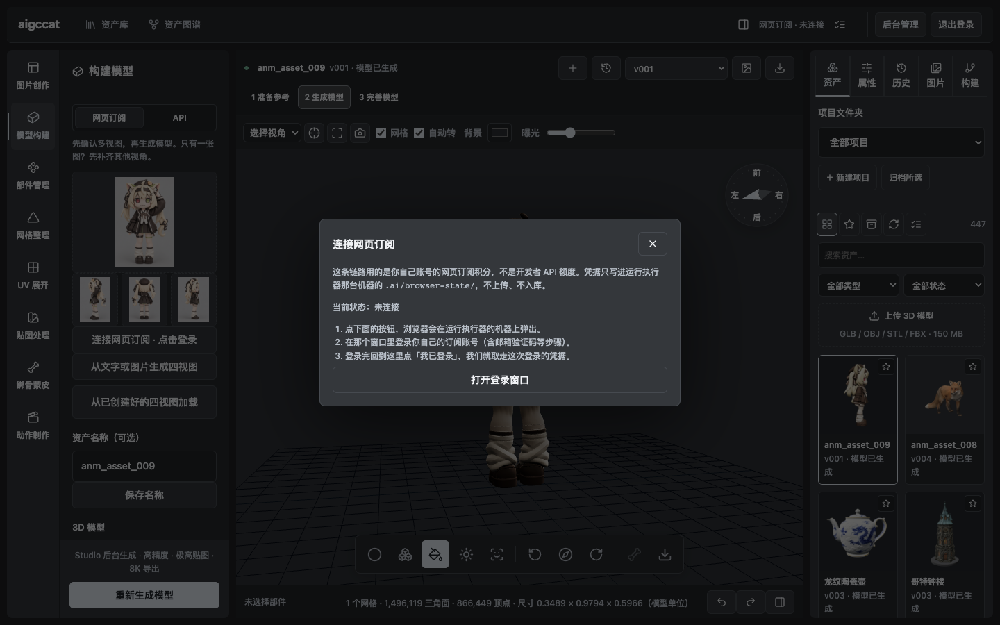

# 接入你自己的「网页订阅」会话

工作台上那句 **「网页订阅 · 已连接」** 的意思是：服务里有一份**你自己账号的网页登录态**，
它拿着这份登录态去提交生成，消耗的是**你网页订阅里的积分**，而不是开发者 API 的额度。

**整套交互都在网页里，宿主机上不需要装任何东西。** 单容器镜像自带一块虚拟屏幕 +
一个真浏览器 + VNC，所以「登录窗口」是**内嵌在对话框里**的一幅画面 ——
你在里面点、输入、收验证码，和在本机开一个浏览器完全一样。

**这件事只能由你做一次**，因为它需要的是你的账号凭据：

- 登录 cookie 等同于账号凭据，不可能随仓库分发 —— `.ai/` 已被 `.gitignore` 排除，我们本地那份也从未提交
- 凭据只写进**服务容器的数据卷**（`/data/studio/`），不上传、不入库
- 所以：一条命令能给你**资产管理与预览**；**要真的生成，得接一次会话**

---

## 1. 前提

| 项 | 要求 |
|---|---|
| 系统 | 任选（登录窗口在容器里跑，与宿主系统无关） |
| 账号 | **你自己的**、有可用额度的订阅账号 |
| 网络 | 能访问 `studio.tripo3d.ai` / `api.tripo3d.ai`；不能直连就在 `.env` 里配 `STUDIO_PROXY` |

> 早期版本需要先在宿主机上装一个常驻执行器（macOS 的 launchd 服务）。
> **现在不需要了**；如果你装过，跑 `python3 scripts/studio-runner/install.py` 会把旧的清退掉。

## 2. 接入

### 第 1 步：起容器

```bash
docker compose -f docker-compose.allinone.yml up -d
```

不需要 `npm install`，也不需要装任何宿主服务 —— 浏览器与执行器都在镜像里。

### 第 2 步：连接你的账号

**方式一 · 界面里点（推荐，也是唯一需要的方式）**

| 动作 | 说明 |
|---|---|
| 1. 打开工作台 | 顶栏右侧状态显示 **「网页订阅 · 未连接」**；「模型构建」面板里也会出现 **连接网页订阅 · 点击登录** |
| 2. 点它 → 点【打开登录窗口】 | 登录画面**直接出现在这个对话框里**（容器内浏览器的实时画面），不用切窗口 |
| 3. 在里面登录 | 用你自己的订阅账号，含邮箱验证码等步骤都在这幅画面里完成 |
| 4. 回到网页点【我已登录，取走凭据】 | 状态变成 **「网页订阅 · 已连接」**，弹窗里会显示剩余积分 |



**这条链路刻意不轮询上游**：窗口打开后，我们不替你去试、也不反复请求站点 ——
那只会让 Cloudflare 的人机校验更容易盯上你。只有你点【我已登录】时，我们才去取一次凭据。

三点要说清楚，避免误会：

- 窗口出现在**运行执行器的那台机器**上。如果你是从别的设备访问界面，请到那台机器上完成登录。
- 取的是**这个窗口**里的登录凭据，不是你日常浏览器的登录态 —— 读你日常浏览器的 cookie 需要动系统钥匙串里的加密密钥，既不可靠也不该那么做。
- 窗口最多开 30 分钟，超时自动关闭；随时可以点【取消并关闭窗口】。取到凭据后窗口也会自动关掉。

**方式二 · 命令行**

```bash
node scripts/studio-runner/connect-session.cjs      # 打开浏览器登录并保存
```

做完后界面上的服务状态同样会变成「网页订阅 · 已连接」。

### 连接工具的其他用法

```bash
# 只校验现有会话，不打开浏览器（会打印令牌有效期与剩余积分）
node scripts/studio-runner/connect-session.cjs --verify

# 你已经有 Playwright 的 storageState 文件（例如 playwright codegen --save-storage 导出的）
node scripts/studio-runner/connect-session.cjs --from ~/auth.json

# 网络需要代理；或反过来强制不使用代理（空串）
STUDIO_PROXY=http://127.0.0.1:7897 node scripts/studio-runner/connect-session.cjs
STUDIO_PROXY= node scripts/studio-runner/connect-session.cjs

# 等待登录的秒数（默认 300）
node scripts/studio-runner/connect-session.cjs --timeout 600
```

> **代理只在显式配置时使用**（环境变量 `STUDIO_PROXY`，或命令行的 `--proxy`）。不设置就是直连。
> 我们**不会**去猜某个本地端口是不是代理 —— 「端口在听」不等于「它是个能用的代理」，
> 把上游流量交给一个不相干的本地服务既不可靠也不安全。
>
> 需要代理的网络环境下，装常驻执行器时把同一行前面也带上它，代理才会写进服务配置：
>
> ```bash
> STUDIO_PROXY=http://127.0.0.1:7897 python3 scripts/studio-runner/install.py
> ```
>
> 判断代理是否真的能用（**注意端口在听 ≠ 能出网**）：
>
> ```bash
> curl -x http://127.0.0.1:7897 -o /dev/null -w '%{http_code}\n' https://api.tripo3d.ai/
> ```

## 3. 怎么算成功（三个都可自查）

| 检查 | 命令 | 期望 |
|---|---|---|
| 会话本身 | `node scripts/studio-runner/connect-session.cjs --verify` | `✔ 会话有效` + 有效期 + 剩余积分 |
| 执行器 | `curl -H "Authorization: Bearer $(cat .ai/browser-state/studio-runner-token)" http://127.0.0.1:8790/health` | `{"ready":true,"mode":"session-http","credits":…}` |
| 界面 | 工作台 →「模型构建」→ 服务状态 | **网页订阅 · 已连接** |

## 4. 令牌与凭据边界

| 文件 | 作用 | 权限 | 会进仓库吗 |
|---|---|---|---|
| `.ai/browser-state/studio-session.auth.json` | 你的网页登录 cookie（只保留 tripo3d.ai 域） | `600` | **不会**（`.ai/` 已被忽略） |
| `.ai/browser-state/studio-runner-token` | 本机执行器与本后端的共享密钥 | `600` | **不会** |
| `.env` 的 `STUDIO_WORKER_TOKEN` | 上面那个密钥，供容器读取 | — | **不会**（`.env` 已被忽略） |

令牌由 `install.py` 自动生成并同步；两边不一致时后端会报「Studio 执行器未配置」或直接 401。
执行器监听 `0.0.0.0:8790`，靠这个 Bearer 令牌保护；如果不需要容器以外的机器访问，
建议在防火墙层面只放行本机。

## 5. 出问题了怎么查

| 现象 | 原因 | 处理 |
|---|---|---|
| 界面显示「网页订阅 · 未连接」 | 执行器没起，或令牌对不上，或还没接会话 | 先按第 2 步接一次会话；再查 `launchctl print gui/$(id -u)/cn.aigccat.studio-worker`，日志在 `~/Library/Application Support/aigccat/studio-worker/.ai/browser-state/error.log` |
| 提示「Studio 执行器未配置」 | 容器没读到 `STUDIO_WORKER_TOKEN` | 按第 1 步重建容器（改 `.env` 后必须重建，不是 restart） |
| 弹窗里显示「执行器不可达」 | 后端连不上宿主执行器 | 执行器没起，或 `STUDIO_WORKER_URL` 不对（容器里默认 `host.docker.internal:8790`） |
| 点【打开登录窗口】后没有窗口弹出 | 运行执行器的那台机器没装 Chrome | 装 Google Chrome，或在那台机器执行 `npx playwright install chromium`（会自动改用自带的 Chromium） |
| 点【我已登录】提示「还没有检测到登录」 | 那个窗口里还没登录成功 | 回去把登录走完（有时要过邮箱验证码），再点一次【我已登录】 |
| 弹窗自己关了，提示「等待登录超时」 | 超过 10 分钟没完成 | 重新打开登录窗口 |
| `--verify` 报「登录已失效」 | 会话确实过期，**或**上游瞬时抖动 | 等十几秒重试；持续失效再重新登录（第 2 步） |
| 报「登录会话刷新连接失败」 | 网络不通 / 代理没生效 | 按上面那条命令先确认代理能不能出网；**代理端口在听不代表它通** |
| 界面显示「未连接 · 连不上上游（网络或代理不通）」 | 同上：上游真的连不上 | 同上。代理恢复后状态会自己变回「已连接」（界面每 30 秒会复查一次） |
| 生成中途失败 | 上游任务失败或超过 30 分钟 | 在任务记录里查原任务；**系统不会自动重发付费请求** |
| 窗口里一直显示 “Just a moment...” 或页面反复刷新 | Cloudflare 人机校验没过（出口 IP 被盯上，或中途换过代理节点） | 等十几秒让它自己走完；**反复挑战就换一个代理节点** —— `cf_clearance` 绑定出口 IP，节点一跳就作废 |
| 点「用 Google 登录」怎么都登不上 | 站点用的是 Google Identity Services（FedCM），在代理 / 自动化浏览器里常报 `NetworkError` | 改用**它自己的邮箱 / 密码或验证码**登录。第三方登录在自动化浏览器里成功率低，这不是本项目的 bug |
| 登录页要求验证码 | 正常的风控 | 在打开的浏览器里手动完成，工具会等你 |

## 6. 边界与风险（请看完再用）

- 这条链路用的是**你订阅对应的网页接口**，不是官方开发者 API。本项目**不绕过任何额度限额**，
  也不会在失败后自动重发付费请求（避免替你花掉额度）。
- 上游接口随时可能变化。我们能做的是跟着修；**它失效不代表本项目其他部分失效**。
- 请只使用**你自己有权使用**的账号。使用方式是否符合上游服务条款、账号是否受影响，
  由使用者自行判断和承担 —— 我们不提供账号，也不代持凭据。
- 会话文件不要外传、不要提交进 git。**一旦泄露，重新登录一次即可**（旧会话随之失效）；
  这是选网页会话而不是长期 API Key 的一个好处：可以随时作废。
- 想更稳妥、更省心的话，**官方开发者 API 是更正规的路子**（本项目也支持，见
  [`SPONSORSHIP.md`](SPONSORSHIP.md) 里的说明）。

## 7. 不用 macOS / 不想装成常驻服务

执行器本体是纯 Node 脚本，任何有 Node 22 的机器都能手动跑：

```bash
cd scripts/studio-runner && npm install
STUDIO_ROOT="$PWD/../.." node server.cjs      # 监听 127.0.0.1:8790
```

再把后端指过去（`STUDIO_WORKER_URL` + `STUDIO_WORKER_TOKEN`）即可。
`install.py` 只负责 macOS 下的 launchd 常驻，不做别的事。

---

# Connecting Your Own Web-Subscription Session

The **"Web subscription · Connected"** badge means a resident worker on *your* machine holds a web
login session for *your own* account and submits generations with it. It spends credits from **your
web subscription**, not from the developer API quota.

**This step can only be done by you, on your machine**, because the credential is yours:

- The login cookies are equivalent to your account credential and can never ship with the repo —
  `.ai/` is git-ignored and our own copy was never committed
- The worker drives a real browser session against the upstream service, so it cannot run inside a
  container (the single-container image included)
- One command gets you **asset management and preview**; **actual generation requires connecting a
  session once**

## Prerequisites

| Item | Requirement |
|---|---|
| OS | macOS installs it as a launchd service; other systems can run it manually (see below) |
| Node.js | 22 or newer (`install.py` prefers `node@22`) |
| Account | **Your own** subscription account with available credits |
| Network | Reachable `studio.tripo3d.ai` / `api.tripo3d.ai`; set up a local proxy first if not |

## Step 1 (once): install the worker

No login needed here — this is what makes the connect entry appear in the UI.

```bash
cd scripts/studio-runner && npm install && cd ../..   # dependencies, once
python3 scripts/studio-runner/install.py              # install the resident worker (writes the token into .env)
docker compose -f docker-compose.allinone.yml up -d   # let the container pick up the token (single container)
docker compose -p aigccat -f docker-compose.yml up -d # multi-container deployments use this line
```

## Step 2: connect your account (either way)

**Option A · from the UI (recommended)**

1. Open the workbench. The status in the header reads **"Web subscription · Not connected"**, and the
   Model build panel shows a **Connect web subscription** button.
2. Click it, then click **Open login window** — a real browser window opens.
3. Log in there with your own subscription account (email codes and the rest happen in that window).
4. Come back and click **「我已登录，取走凭据」** (I've logged in). The status turns into
   **"Web subscription · Connected"** and the remaining credits are shown.

Three things worth knowing:

- The window opens **on the machine running the worker**. If you are reaching the UI from another
  device, walk over to that machine to log in.
- It captures the cookies of **that window only**, not your everyday browser's login. Reading your
  everyday browser's cookies would require unlocking the OS keychain — unreliable and not something
  we should do.
- The login window closes itself after 30 minutes (or when you click Cancel), and it closes
  automatically once the credential is saved.

**Option B · from the command line**

```bash
node scripts/studio-runner/connect-session.cjs      # opens a browser, logs in, saves the session
```

Extra options:

```bash
node scripts/studio-runner/connect-session.cjs --verify                 # check only, no browser
node scripts/studio-runner/connect-session.cjs --from ~/auth.json       # import an existing storageState
node scripts/studio-runner/connect-session.cjs --timeout 600            # wait longer for login
STUDIO_PROXY=http://127.0.0.1:7897 node scripts/studio-runner/connect-session.cjs
STUDIO_PROXY= node scripts/studio-runner/connect-session.cjs            # force direct connection
```

> **A proxy is used only when you configure one explicitly** (`STUDIO_PROXY`, or `--proxy` on the CLI).
> Unset means a direct connection. We deliberately do **not** guess whether some local port is a proxy —
> "the port is listening" does not mean "it is a usable proxy", and routing upstream traffic into an
> unrelated local service is neither reliable nor safe.
>
> If your network needs a proxy, pass it when installing the resident worker so it lands in the service
> configuration:
>
> ```bash
> STUDIO_PROXY=http://127.0.0.1:7897 python3 scripts/studio-runner/install.py
> ```
>
> To check whether a proxy actually works (**listening ≠ can reach the internet**):
>
> ```bash
> curl -x http://127.0.0.1:7897 -o /dev/null -w '%{http_code}\n' https://api.tripo3d.ai/
> ```

## Verifying it works

| Check | Command | Expected |
|---|---|---|
| Session | `connect-session.cjs --verify` | `✔ 会话有效` plus expiry and remaining credits |
| Worker | `curl -H "Authorization: Bearer $(cat .ai/browser-state/studio-runner-token)" http://127.0.0.1:8790/health` | `{"ready":true,"mode":"session-http","credits":…}` |
| UI | Workbench → Model build → service status | **Web subscription · Connected** |

## Credentials boundary

| File | Purpose | Mode | Committed? |
|---|---|---|---|
| `.ai/browser-state/studio-session.auth.json` | Your web login cookies (tripo3d.ai domains only) | `600` | **No** |
| `.ai/browser-state/studio-runner-token` | Shared secret between the worker and this backend | `600` | **No** |
| `STUDIO_WORKER_TOKEN` in `.env` | The same secret, read by the container | — | **No** |

Troubleshooting, limits and risks are the same as in the Chinese section above: session expiry
(try again after a few seconds, re-login if persistent), missing `STUDIO_WORKER_TOKEN`
(recreate the container, don't just restart), network issues (set `STUDIO_PROXY`), and failed
generations (check the original task; **paid requests are never retried automatically**).

**Boundaries:** this path uses the web endpoints behind your own subscription, not the official
developer API. We do **not** bypass any quota and we never resend paid requests automatically.
Upstream endpoints may change at any time. Use only an account you are entitled to use, and judge
for yourself whether the usage fits the upstream terms. Never share or commit the session file —
if it leaks, log in again and the old session dies. If you want the well-trodden route, the
official developer API is also supported (see [`SPONSORSHIP.md`](SPONSORSHIP.md)).

**Two environment caveats we hit in practice.** The site sits behind a Cloudflare human check
("Just a moment..."), and `cf_clearance` is bound to your exit IP — if your proxy rotates nodes the
challenge restarts, so pin one node while logging in. And its "Sign in with Google" uses Google
Identity Services (FedCM), which commonly fails with `NetworkError` in a proxied or automated
browser; prefer the site's own email/password or email-code login. Neither is a bug in this project,
and this link never polls the upstream while you are logging in — it only fetches the credential
once, when you click **I've logged in**.

**Not on macOS?** The worker is plain Node:

```bash
cd scripts/studio-runner && npm install
STUDIO_ROOT="$PWD/../.." node server.cjs      # listens on 127.0.0.1:8790
```

Point the backend at it with `STUDIO_WORKER_URL` + `STUDIO_WORKER_TOKEN`.
